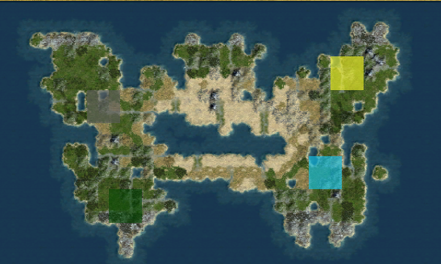
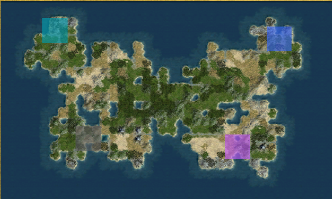

# Symmetrigaea.py

A Civilization IV: Beyond the Sword mapscript based on GeometricMultiFractal.py. It generates a roughly symmetrical continent with or without a small inland sea.
Intended for multiplayer games. Has special balancing features for team-based games.




# Features

## Map generation

- The script starts with a region mask in the center, places several more region masks on one half of the map, and mirrors it.
- The region mask map is rerolled until it is within global land area thresholds.
- The script uses [GeometricMultiFractal's](https://github.com/AineiasStymphalios/GeometricMultiFractal) method to generate plots inside the masks.
- The Inland Sea option cuts a connected water hole. The script repairs land connections without filling the hole.

## Teamer Balancing
- Places two teams on opposite ends of the continent.
- Balances strategic, quarry, and happyness bonuses per team.
- River mouths placed roughly evenly between map halves.

## Map Options

- Sea Level: Low, Medium, or High.
- World Wrap: Flat, Cylindrical, or Toroidal.
- Continent Symmetry: Left/Right or 180-degree rotation.
- Center Terrain: Inland Sea or Land Bridge.
- Climate Details: Moist center and rim, dry center, or Civ4 default.
- Start Options: Team Start or Default Starts. Team Start assigns two teams to opposite sides.
- Teamer Resource Balancing: Disabled or enabled. Enable when playing in teamer multiplayer games. 
- Land Food Across Map: Fills spots in the map with poor food. Disabled or minimum spacing of 3, 4, or 5 tiles.
- Land Food on Starts: Disabled or at least 1, 2, or 3 bonuses per starting BFC.
- Strategic Resources Near Starts: Disabled, Iron plus Copper or Horse, or all three.
- Reveal Start Area Radius: Disabled or radius 2, 3, or 4.


# Instructions
1. Download Symmetrigaea.py from the latest [release.](https://github.com/AineiasStymphalios/Symmetrigaea.py/releases)
2. Add Symmetrigaea.py to:
- CD version:
```
C:\Program Files\Firaxis Games\Civilization 4\Beyond the Sword\PublicMaps
```

- Steam version:
```
C:\Program Files (x86)\Steam\steamapps\common\Sid Meier's Civilization IV Beyond the Sword\Beyond the Sword\PublicMaps
```

3. Select Symmetrigaea in *Play Now* or *Custom Game*.

## Version support

Civilization IV: Beyond the Sword.

# Extra: Symmetrigaea Simulator
Python script which simulates Symmetrigaea's plot generation.
See included readme.
